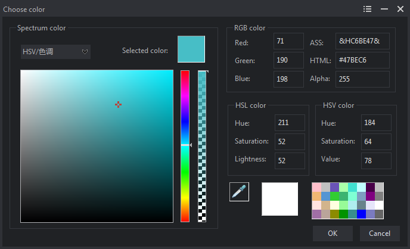

## 简介：
一款使用wtl编写的颜色选择器，支持从RGB、HSV颜色空间中选择颜色以及屏幕取色

## 编译：  
工具：Visual Studio 2013  

库：WTL10  
[https://sourceforge.net/projects/wtl/files/](https://sourceforge.net/projects/wtl/files/)
## 运行环境：  
window7、10  
## 关于作者：  
(◍°∇°◍)ﾉﾞ来点个赞吧~    
[https://space.bilibili.com/273436120](https://space.bilibili.com/273436120)
